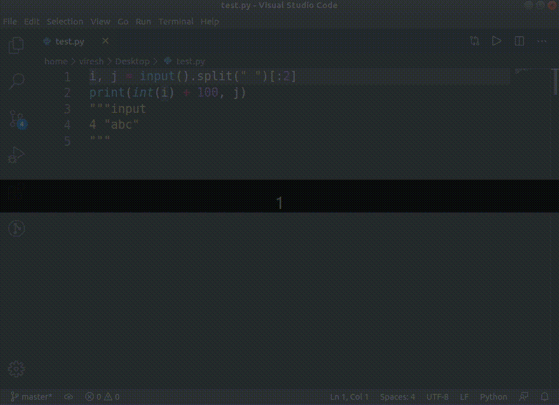

# Comment Input  

Send input to your single-file applications with ease!  
Just add a comment in your source with desired input and voila!  

Aimed at competitive programmers and Data Scientists who spend time debugging small (single file) scripts.

## Features

- Select a custom keyphrase  
- Supported for all languages that have a block comment and are supported by code-runner*  
- Uses VSCode's internal comment settings, no need for extra configuration  
- Uses integrated terminal, so you don't have to switch tabs often  
- Set custom delay between code compilation and input
- No configuration required on Windows, MacOS and Linux with default VSCode installation**. 

\* code-runner has some limitations and all those apply to this extension as well.  
\*\* For non-default install locations, extension needs to be configured.

## Requirements
[code-runner](https://github.com/formulahendry/vscode-code-runner) is required for this extension to work since VSCode doesn't support hijacking terminal input.

Further, if the extension is not installed in default location, please configure `cinp.language_extension_resources_folder`. This is required due to a known issue.

On windows, integrated terminal with cmd is required. Powershell will not work.

## Extension Settings

* `cinp.trigger`: Set the keyword for comment identification. Default is "input".
* `cinp.input_delay`: Set the delay between code compilation and input in milliseconds. Default is "500".
* `cinp.language_extension_resources_folder`: Set the Language Configuration folder. Automatically set on linux, mac and windows to default locations. Configure only if not a default installation.

-----------------------------------------------------------------------------------------------------------

## Usage

A sample script looking as follows:  
```python
"""input 4 "abc" """
i, j = input().split(" ")
print(int(i) + 100, j)
```

Similarly for c++:
```c++
#include <iostream>
using namespace std;
/*input
4 "abc"
*/
int main(){
    string s;
    cin>>s;
    cout<<s<<"\n";
}
```

will be executed with `4 "abc"` sent to stdin of the terminal. 



## Known Issues
- VSCode doesn't provide an api to read the language settings yet. Thus, I've used a workaround which is not guaranteed to work if your settings are saved in a different location. Issue Link: https://github.com/microsoft/vscode/issues/2871  
- There is a delay between sending input and code compilation / execution. Thus, it's possible that delay isn't long enough to account for compilation failures.  
- The extension works only if cmd is used as the default terminal profile on Windows.  
- Depending on your python version / platform, adding a newline after input might or might not work as expected. Best is to start input from the same line as trigger keyword.  
- The input is sent all at once, so if compilation / interpreter failed, then the input is still sent. This is a limitation because there's no way to know the result of compilation / interpreter from previous step.  

## Contributing
People are invited to help out with code / tests / documentation. Please send PRs / file issues on Github repository itself.

## FAQ
* Block comments not working in Python!  
  Please ensure that you are using the correct block comment character. Python supports multiline strings with both `"""` and `'''`. The one that is set to block comment character in VSCode's language settings is the one that is used. It defaults to `"""`.

### Acknowledgement
A [similar extension](https://packagecontrol.io/packages/Sublime%20Input) exists in sublime-text as well.  
Icon credits: Terminal Icon from [freepik.com](https://www.flaticon.com/authors/freepik) / [flaticon.com](www.flaticon.com). Edited myself via Inkscape.
